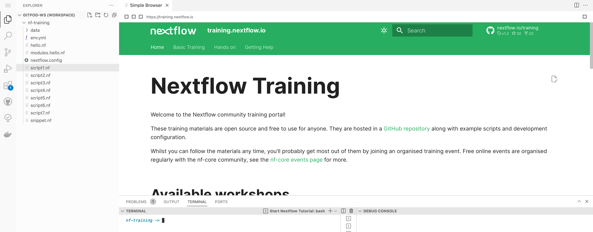

# Environment setup

There are two main ways to get started with Seqera’s Nextflow training course.

The first is to install the requirements locally ([Local installation](#local-installation)), which is best if you are already familiar with Git and Docker, or working offline.

The second is to use [Gitpod](#gitpod), which is best for first-timers as this platform contains all the programs and data required. Simply click the link and log in using your GitHub account to start the tutorial:

[](https://gitpod.io/#https://github.com/nextflow-io/training)

## Local installation

Nextflow can be used on any POSIX-compatible system (Linux, macOS, Windows Subsystem for Linux, etc.).

#### Requirements

-   Bash
-   [Java 11 (or later, up to 18)](https://www.oracle.com/technetwork/java/javase/downloads/index.html)
-   Git
-   [Docker](https://docs.docker.com/get-docker/)

#### Optional requirements for this tutorial

-   [Singularity](https://github.com/sylabs/singularity) 2.5.x (or later)
-   [Conda](https://conda.io/) 4.5 (or later)
-   [Graphviz](http://www.graphviz.org/)
-   [AWS CLI](https://aws.amazon.com/cli/)
-   A configured AWS Batch computing environment

### Download Nextflow

Enter this command in your terminal:

```bash
wget -qO- https://get.nextflow.io | bash
```

Or, if you prefer curl:

```bash
curl -s https://get.nextflow.io | bash
```

Then ensure that the downloaded binary is executable:

```bash
chmod +x nextflow
```

AND put the `nextflow` executable into your `$PATH` (e.g. `/usr/local/bin` or `/bin/`)

### Docker

Ensure you have Docker Desktop running on your machine. Download Docker [here](https://docs.docker.com/get-docker/).

### Training material

You can view the training material here: <https://training.nextflow.io/>

To download the material use the command:

```bash
git clone https://github.com/nextflow-io/training.git
```

Then `cd` into the `nf-training` directory.

### Checking your installation

Check the correct installation of `nextflow` by running the following command:

```bash
nextflow info
```

This should show the current version, system and runtime.

## Gitpod

A preconfigured Nextflow development environment is available using Gitpod.

#### Requirements

-   A GitHub account
-   Web browser (Google Chrome, Firefox)
-   Internet connection

### Gitpod quick start

To run Gitpod:

-   Click the following URL: <https://gitpod.io/#https://github.com/nextflow-io/training>
    -   This is our GitHub repository URL, prefixed with `https://gitpod.io/#`
-   Log in to your GitHub account (and allow authorization).

Once you have signed in, Gitpod should load (skip prebuild if asked).

### Explore your Gitpod IDE

You should now see something similar to the following:



-   **The sidebar** allows you to customize your Gitpod environment and perform basic tasks (copy, paste, open files, search, git, etc.). Click the Explorer button to see which files are in this repository.
-   **The terminal** allows you to run all the programs in the repository. For example, both `nextflow` and `docker` are installed and can be executed.
-   **The main window** allows you to view and edit files. Clicking on a file in the explorer will open it within the main window. You should also see the nf-training material browser (<https://training.nextflow.io/>).

To test that the environment is working correctly, type the following into the terminal:

```bash
nextflow info
```

This should come up with the Nextflow version and runtime information:

```
Version: 22.10.4 build 5836
Created: 09-12-2022 09:58 UTC
System: Linux 5.15.0-47-generic
Runtime: Groovy 3.0.13 on OpenJDK 64-Bit Server VM 17.0.3-internal+0-adhoc..src
Encoding: UTF-8 (UTF-8)
```

### Gitpod resources

-   Gitpod gives you 500 free credits per month, which is equivalent to 50 hours of free environment runtime using the standard workspace (up to 4 cores, 8 GB RAM and 30 GB storage).
-   There is also a large workspace option that gives you up to 8 cores, 16GB RAM, and 50GB storage. However, the large workspace will use your free credits faster and you will have fewer hours of access to this space.
-   Gitpod will time out after 30 minutes of inactivity and will save your changes for up to 2 weeks (see the next section for reopening a timed-out session).

See [gitpod.io](https://www.gitpod.io) for more details.

### Reopening a Gitpod session

You can reopen an environment from <https://gitpod.io/workspaces>. Find your previous environment in the list, then select the ellipsis (three dots icon) and select Open.

If you have saved the URL for your previous Gitpod environment, you can simply open it in your browser.

Alternatively, you can start a new workspace by following the Gitpod URL: <https://gitpod.io/#https://github.com/nextflow-io/training>

If you have lost your environment, you can find the main scripts used in this tutorial in the `nf-training` directory.

### Saving files from Gitpod to your local machine

To save any file from the explorer panel, right-click the file and select `Download`.

### Training material

The training course can be accessed in your browser from <https://training.nextflow.io/>

## Selecting a Nextflow version

By default, Nextflow will pull the latest stable version into your environment.

However, Nextflow is constantly evolving as we make improvements and fix bugs.

The latest releases can be viewed on GitHub [here](https://github.com/nextflow-io/nextflow).

If you want to use a specific version of Nextflow, you can set the `NXF_VER` variable as shown below:

```bash
export NXF_VER=22.04.5
```

!!! Note

    This tutorial workshop requires `NXF_VER=22.04.0`, or later. This version will use DSL2 as default.

Run `nextflow -version` again to confirm that the change has taken effect.
