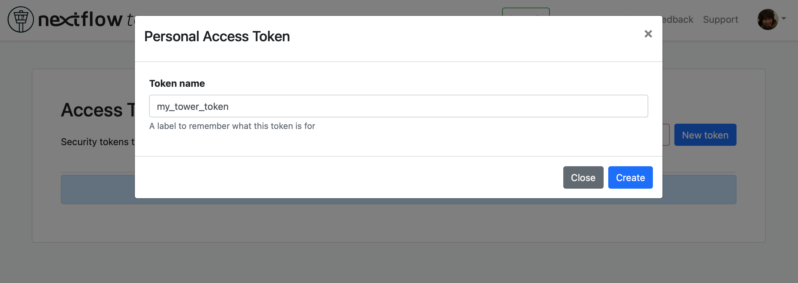
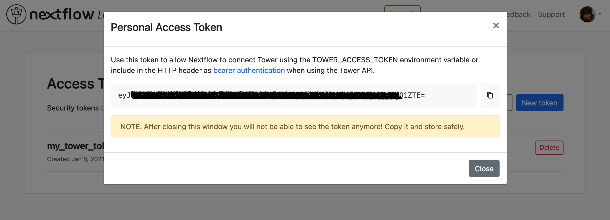
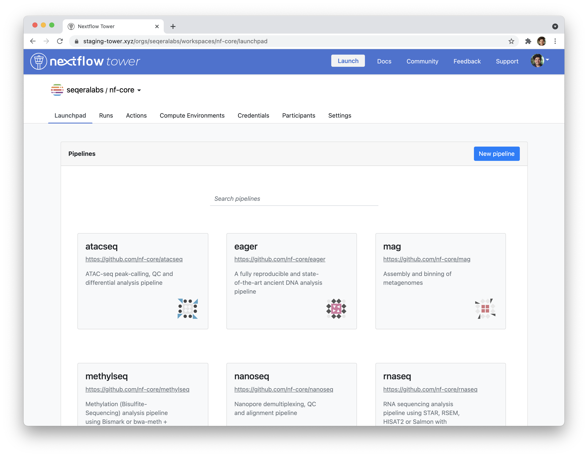

# Get started with Nextflow Tower

## Basic concepts

Nextflow Tower is the centralized command post for data management and pipelines. It brings monitoring, logging and observability to distributed workflows and simplifies the deployment of pipelines on any cloud, cluster or laptop.

Nextflow tower core features include:

-   The launching of pre-configured pipelines with ease.

-   Programmatic integration to meet the needs of an organization.

-   Publishing pipelines to shared workspaces.

-   Management of the infrastructure required to run data analysis at scale.

[Sign](https://cloud.tower.nf/) up to try Tower for free or request a [demo](https://seqera.io/demo/) for deployments in your own on-premise or cloud environment.

## Usage

You can use Tower via either the `-with-tower` option while using the Nextflow **run** command, through the **online GUI** or through the **API**.

### Via the Nextflow `run` command

Create an account and login into Tower.

**1. Create a new token**

You can access your tokens from the **Settings** drop-down menu :

**2. Name your token**

**3. Save your token safely**

Copy and keep your new token in a safe place.

**4. Export your token**

Once your token has been created, open a terminal and type:

    export TOWER_ACCESS_TOKEN=eyxxxxxxxxxxxxxxxQ1ZTE=
    export NXF_VER=20.10.0

Where `eyxxxxxxxxxxxxxxxQ1ZTE=` is the token you have just created.

Check your `nextflow -version`. Bearer tokens require Nextflow version 20.10.0 or later and can be set with the second command shown above. You can change the version if necessary.

To submit a pipeline to a [Workspace](https://help.tower.nf/getting-started/workspace/) using the Nextflow command-line tool, add the workspace ID to your environment. For example:

    export TOWER_WORKSPACE_ID=000000000000000

The workspace ID can be found on the organization’s Workspaces overview page.

**5. Run Nextflow with tower**

Run your Nextflow workflows as usual with the addition of the `-with-tower` command:

    nextflow run hello.nf -with-tower

You will see and be able to monitor your **Nextflow jobs** in Tower.

To configure and execute Nextflow jobs in **Cloud environments**, visit the [Compute environments section](https://help.tower.nf/compute-envs/overview/).

Run the RNA-Seq `script7.nf` using the `-with-tower` flag, after correctly completing the token settings outlined above.

Go to <https://tower.nf/>, login, then click the run tab, and select the run that you just submitted. If you can’t find it, double check your token was entered correctly.

### Via online GUI

To run using the GUI, there are three main steps:

**1.** Create an account and login into Tower, available free of charge, at [tower.nf](https://tower.nf).

**2.** Create and configure a new [compute environment](https://help.tower.nf/compute-envs/overview/).

**3.** Start [launching pipelines](https://help.tower.nf/launch/launchpad/).

#### Configuring your compute environment

Tower uses the concept of **Compute Environments** to define the execution platform where a pipeline will run.

It supports the launching of pipelines into a growing number of **cloud** and **on-premise** infrastructures.

Each compute environment must be pre-configured to enable Tower to submit tasks. You can read more on how to set up each environment using the links below.

The following guides describe how to configure each of these compute environments.

[AWS Batch](https://help.tower.nf/compute-envs/aws-batch/) [Azure Batch](https://help.tower.nf/compute-envs/azure-batch/) [Google Cloud](https://help.tower.nf/compute-envs/google-cloud/) [IBM LSF](https://help.tower.nf/compute-envs/lsf/) [Slurm](https://help.tower.nf/compute-envs/slurm/) [Grid Engine](https://help.tower.nf/compute-envs/grid-engine/) [Altair PBS Pro](https://help.tower.nf/compute-envs/altair-pbs-pro/) [Amazon Kubernetes (EKS)](https://help.tower.nf/compute-envs/eks/) [Google Kubernetes (GKE)](https://help.tower.nf/compute-envs/gke/) [Hosted Kubernetes](https://help.tower.nf/compute-envs/k8s/)

#### Selecting a default compute environment

If you have more than one **Compute Environment**, you can select which one will be used by default when launching a pipeline.

1. Navigate to your [compute environments](https://help.tower.nf/compute-envs/overview/).

2. Choose your default environment by selecting the **Make primary** button.

**Congratulations!**

You are now ready to launch pipelines with your primary compute environment.

#### Launchpad

Launchpad makes it easy for any workspace user to launch a pre-configured pipeline.

A pipeline is a repository containing a Nextflow workflow, a compute environment and pipeline parameters.

#### Pipeline Parameters Form

Launchpad automatically detects the presence of a `nextflow_schema.json` in the root of the repository and dynamically creates a form where users can easily update the parameters.

The parameter forms view will appear if the workflow has a Nextflow schema file for the parameters. Please refer to the [Nextflow Schema guide](https://help.tower.nf/pipeline-schema/overview) to learn more about the schema file use-cases and how to create them.

This makes it trivial for users without any expertise in Nextflow to enter their pipeline parameters and launch.

#### Adding a new pipeline

Adding a pipeline to the pre-saved workspace launchpad is detailed in full on the [tower webpage docs](https://help.tower.nf/launch/launch/).

In brief, these are the steps you need to follow to set up a pipeline.

1.  Select the Launchpad button in the navigation bar. This will open the **Launch Form**.

2.  Select a [compute environment](https://help.tower.nf/compute-envs/overview).

3.  Enter the repository of the pipeline you want to launch. e.g. <https://github.com/nf-core/rnaseq.git>

4.  Select a pipeline **Revision number**. The Git default branch (main/master) or `manifest.defaultBranch` in the Nextflow configuration will be used by default.

5.  Set the **Work directory** location of the Nextflow work directory. The location associated with the compute environment will be selected by default.

6.  Enter the name(s) of each of the Nextflow **Config profiles** followed by the `Enter` key. See the Nextflow [Config profiles](https://www.nextflow.io/docs/latest/config.html#config-profiles) documentation for more details.

7.  Enter any Pipeline parameters in YAML or JSON format. YAML example:

        reads: 's3://nf-bucket/exome-data/ERR013140_{1,2}.fastq.bz2'
        paired_end: true

8.  Select Launchpad to begin the pipeline execution.

Nextflow pipelines are simply Git repositories and can be changed to any public or private Git-hosting platform. See Git Integration in the Tower docs and Pipeline Sharing in the Nextflow docs for more details.

The credentials associated with the compute environment must be able to access the work directory.

In the configuration, the full path to a bucket must be specified with single quotes around strings and no quotes around booleans or numbers.

To create your own customized Nextflow Schema for your pipeline, see the examples from the `nf-core` workflows that have adopted this approach. For example, [eager](https://github.com/nf-core/eager/blob/2.3.3/nextflow_schema.json) and [rnaseq](https://github.com/nf-core/rnaseq/blob/3.0/nextflow_schema.json).

For advanced settings options check out this [page](https://help.tower.nf/launch/advanced/).

There is also community support available if you get into trouble, join the Nextflow Slack by following this [link](https://www.nextflow.io/slack-invite.html).

### API

To learn more about using the Tower API, visit the [API section](https://help.tower.nf/api/overview/) in this documentation.

## Workspaces and Organizations

Nextflow Tower simplifies the development and execution of workflows by providing a centralized interface for users and organizations.

Each user has a unique **workspace** where they can interact and manage all resources such as workflows, compute environments and credentials. Details of this can be found [here](https://help.tower.nf/getting-started/workspace/).

By default, each user has their own private workspace, while organizations have the ability to run and manage users through role-based access as **members** and **collaborators**.

### Organization resources

You can create your own organization and participant workspace by following the docs at [tower](https://help.tower.nf/orgs-and-teams/workspace-management/).

Tower allows the creation of multiple organizations, each of which can contain multiple workspaces with shared users and resources. This allows any organization to customize and organize the usage of resources while maintaining an access control layer for users associated with a workspace.

### Organization users

Any user can be added or removed from a particular organization or a workspace and can be allocated a specific access role within that workspace.

The Teams feature provides a way for organizations to group various users and participants together into teams. For example, `workflow-developers` or `analysts`, and apply access control to all the users within this team collectively.

For further information, please refer to the [User Management](https://help.tower.nf/orgs-and-teams/organizations/) section.

#### Setting up a new organization

Organizations are the top-level structure and contain Workspaces, Members, Teams and Collaborators.

To create a new Organization:

1. Click on the dropdown next to your name and select New organization to open the creation dialog.

2. On the dialog, fill in the fields as per your organization. The Name and Full name fields are compulsory.

    A valid name for the organization must follow a specific pattern. Please refer to the UI for further instructions.

3. The rest of the fields such as Description, Location, Website URL and Logo Url are optional.

4. Once the details are filled in, you can access the newly created organization using the organization’s page, which lists all of your organizations.

    It is possible to change the values of the optional fields either using the Edit option on the organization’s page or by using the Settings tab within the organization page, provided that you are the Owner of the organization.

    A list of all the included Members, Teams and Collaborators can be found on the organization page.
